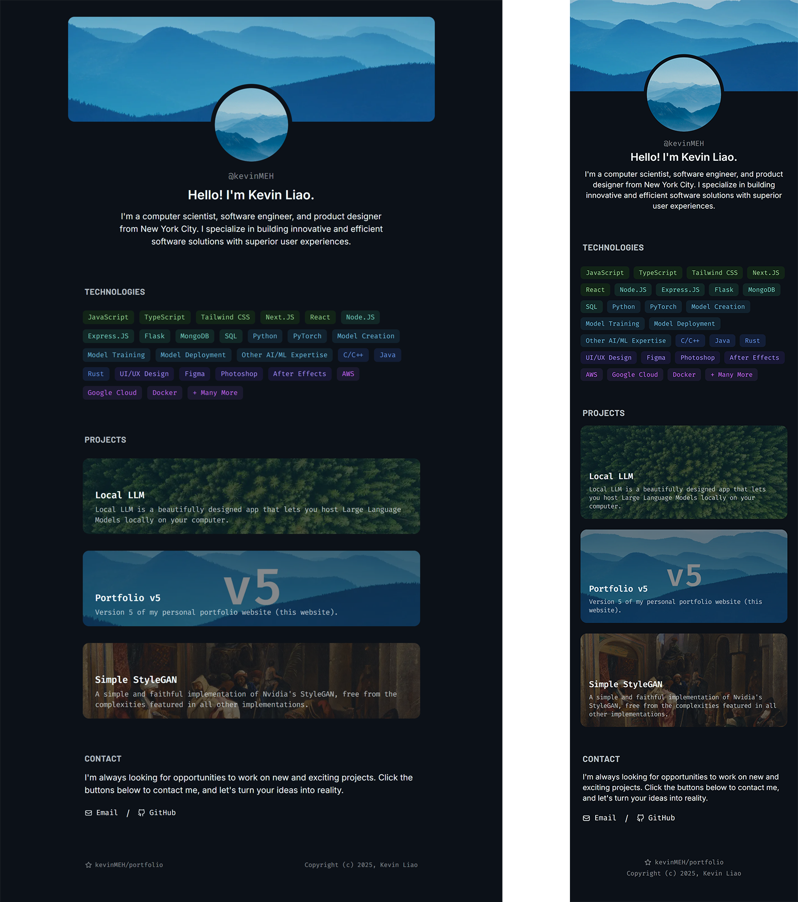
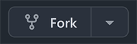

# portfolio

Version 5 of my personal portfolio.

Beautifully designed, meticulously optimized, infinitely customizable.



### Can I use your portfolio as my own?

Sure, just make sure to provide attribution. The simpliest way is just to fork
this repository, and include a link to your own repository or this repository
in your portfolio website. Do not clone and republish this repository.

## Modification Guide

### Data

To customize your portfolio, simply supply a `data.json` file inside the
`public` folder with the data that you want.

Inside the `public` folder, you will find a `data.example.json` file. This file
serves as an example as to how your `data.json` file should look like. For a
more complete explanation on the contents of each field, please refer to
[`Customize.md`](./Customize.md).

### Images

To customize the images displayed, please replace the images inside `public`
with your own. For more details on the recommended specifications of the images,
please refer to [`Customize.md`](./Customize.md).

### Colors

You can change the theme colors by directly modifying the values inside
`tailwind.config.js`.

## Installation

First, press the fork button above and follow the instructions:



Navigate to your project page, copy the URL, and clone your repository:

```bash
git clone https://github.com/<YOUR_USERNAME>/portfolio
```

Navigate to your project directory and install dependencies:

```bash
cd portfolio
npm install
```

Follow the modification guide above and customize your portfolio.
- [ ] Create `public/data.json` based on `public/data.example.json`
- [ ] Modify `public/data.json` with your own details
- [ ] Replace the images in `public/images` with your own

Next, start the development server:

```bash
npm run dev
```

Open [http://127.0.0.1:3000](http://127.0.0.1:3000) and you're done!

---

###### Copyright (c) 2025, Kevin Liao
