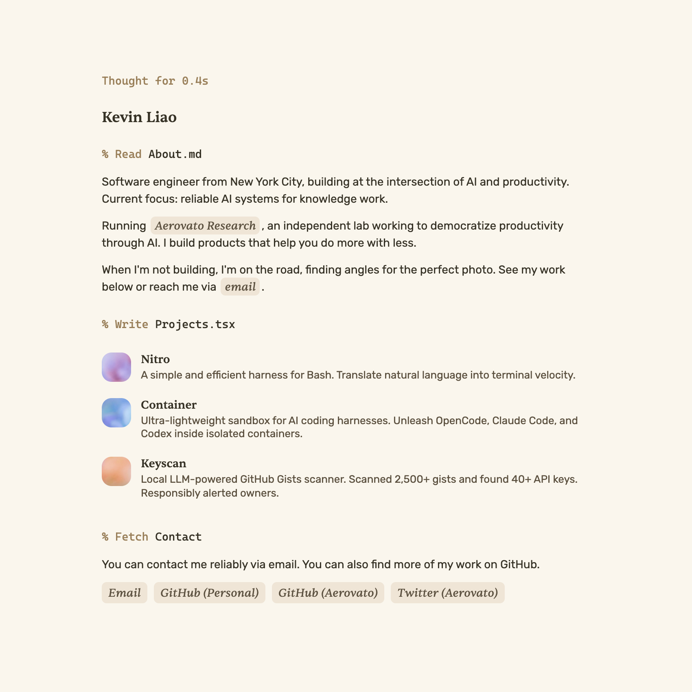

# portfolio

Version 6 of my personal portfolio. See it live at [liao.gg](https://liao.gg).

<p align="center">
  
</p>

## Features

- Fully static; no SSR or client-side hydration; all content available statically
- No flash of unstyled or fully-visible content before the animation begins
- Graceful fallback: no-JS users and `prefers-reduced-motion` users see all content immediately
- Light and dark themes with a persisted preference

## Tech Stack

- [SvelteKit](https://kit.svelte.dev/) with [`@sveltejs/adapter-static`](https://github.com/sveltejs/kit/tree/main/packages/adapter-static) for prerendered HTML
- [Tailwind CSS](https://tailwindcss.com/) v4 with a custom palette only
- [TypeScript](https://www.typescriptlang.org/)

## Getting Started

Prerequisites: [Node.js](https://nodejs.org/) and npm.

Install dependencies:

```bash
npm install
```

Start the development server:

```bash
npm run dev
```

Then open the printed local URL (default [http://127.0.0.1:3000](http://127.0.0.1:3000)).

### Fonts

The Sentient font is licensed from [Indian Type Foundry](https://www.indiantypefoundry.com/) via [Fontshare](https://www.fontshare.com/) and is not redistributable, so its files are gitignored and excluded from this repository.

Download [Sentient](https://www.fontshare.com/fonts/sentient) from Fontshare and place the two variable WOFF2 files in `static/fonts/` with these exact names (matching the `@font-face` declarations in `src/app.css`):

```
static/fonts/Sentient-Variable.woff2
static/fonts/Sentient-VariableItalic.woff2
```

Without these files the site still runs; titles and link buttons just fall back to the system serif.

## Project Structure

```
src/
  app.css                         Global styles, fonts, theme tokens
  app.html                        HTML shell with pre-paint theme + reveal gate
  lib/
    preferences.ts                Theme and animation preference types and helpers
    reveal.ts                     Shared reveal API interface and timing helper
    site.ts                       Typed site metadata, projects, contacts, JSON-LD
    components/
      Section.svelte              Terminal-style section wrapper with reveal()
      Project.svelte              Project card with sequenced reveal()
      LinkButton.svelte           Styled link button with reveal()
      PreferenceControls.svelte   Theme and animation toggle controls
      ProgressiveText.svelte      Server-rendered word-batched text reveal
      ThinkingText.svelte         Randomized "thinking" status indicator
  routes/
    +layout.svelte                Imports global styles, renders page children
    +page.svelte                  Portfolio home page and reveal orchestration
    +page.ts                      Enables static prerendering
static/
  fonts/                          Fonts
  images/                         Project thumbnails and social preview image
```

## Scripts

- `npm run dev` — start the Vite dev server
- `npm run build` — produce a static production build
- `npm run preview` — preview the production build locally
- `npm run check` — run `svelte-check` for type validation

---

###### Copyright (c) 2026, Kevin Liao
